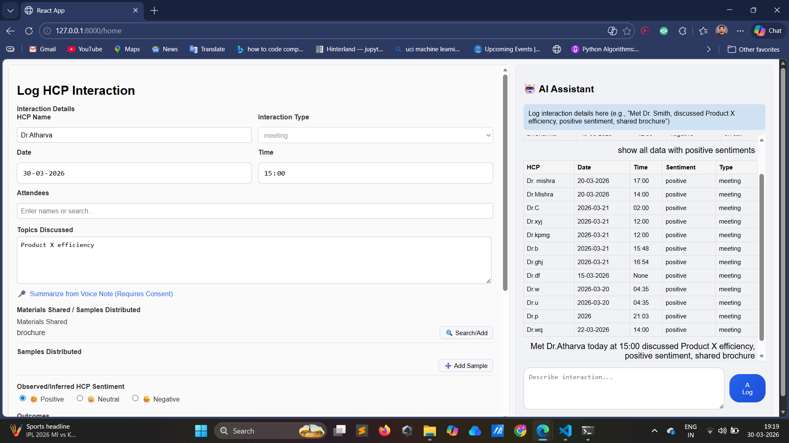

Built an AI-powered HCP interaction system using LangGraph, React, Redux, and FastAPI that enables users to add, edit, query, delete, and generate follow-ups using natural language with real-time UI synchronization.

# 🚀 AI-Powered HCP Interaction Assistant

---

## 🔹 Overview
- Built an **AI-driven interaction logging system** where users describe interactions in natural language, and the system automatically extracts, manages, and queries structured data.
- Implemented a **split-screen UI**:
  - Left → Interaction form  
  - Right → AI assistant  
- The form is fully controlled by AI, eliminating manual data entry.

---

## 🔹 Tech Stack
- **Frontend:** React, Redux  
- **Backend:** FastAPI  
- **AI Orchestration:** LangGraph  
- **Database:** MySQL  
- **LLM Integration:** Structured output using Pydantic schemas  

---

## 🔹 Key Features

### 🤖 AI-Controlled Form (Core Requirement)
- Users **cannot manually fill the form**
- AI assistant parses natural language input and **auto-populates all fields**
- Supports **partial data rendering** (fills available fields progressively)

---

### 🧠 Multi-Tool LangGraph Agent

#### 1. Log Interaction Tool
- Extracts structured data:
  - HCP name, date, time, topics, materials, sentiment, etc.
- Validates required fields
- Asks follow-up questions if data is incomplete
- Saves to MySQL **only when data is complete**

---

#### 2. Edit Interaction Tool
- Updates specific fields using natural language  
- Example: change name to Dr. Mishra

- Dynamically updates the **latest inserted record**

---

#### 3. Query Tool
- Converts natural language into database filters  
- Supports:
- sentiment-based queries  
- date-based queries (today, yesterday)  
- partial matching (e.g., doctor name)  
- Example: show all data with positive sentiment

- Returns results in **table-like format in UI**

---

#### 4. Delete Tool
- Users can delete HCP records using natural language  
- Example: delete interaction with Dr Sharma

---

#### 5. Follow-up Generator
- Automatically generates **AI-based follow-ups**
- Focuses on:
- last 2–3 HCPs  
- positive or neutral sentiment  
- Helps in decision support and next actions

---

#### 6. Intent Classification Node
- Uses LLM to classify user intent:
- log  
- edit  
- query  
- delete  
- follow-up  
- Routes request dynamically using LangGraph

---

#### 7. Follow-up Handling
- Detects missing fields
- Generates **dynamic clarification questions**
- Supports multi-turn conversations

---

## 🔄 State Management (Redux)
- Centralized state using Redux
- Stores:
- interaction data  
- chat history  
- Enables **real-time UI synchronization** between AI and form

---

## 🗄️ Database Integration
- Designed relational schema using SQLAlchemy ORM
- Supports:
- Insert (log interaction)  
- Update (edit interaction)  
- Delete (remove interaction)  
- Dynamic filtering (query tool)  

---

## 💬 Chat-Based Interaction System
- Built conversational interface:
- User messages → right-aligned  
- AI responses → left-aligned  
- Handles:
- multi-turn conversations  
- progressive data collection  

---

## 🔹 Advanced Capabilities
- 🧩 Structured LLM outputs using Pydantic (no manual JSON parsing)  
- 🔁 Dynamic tool routing with LangGraph  
- 🧠 Natural language → database query conversion  
- ⏱️ Time normalization (e.g., “6 hours ago” → HH:MM)  
- 📅 Date normalization (today/yesterday → actual date)  
- 🔒 Fully AI-controlled form (no manual edits allowed)  

---

## 🔹 Challenges Solved
- Prevented LLM hallucination using strict extraction prompts  
- Built dynamic query system without hardcoded filters  
- Managed multi-turn conversational state reliably  
- Ensured UI consistency using Redux  
- Handled partial and incremental data updates  

---

## 🔹 Outcome
- Delivered a **production-like AI assistant system**
- Demonstrated:
- LLM orchestration using LangGraph  
- Full-stack integration (React + FastAPI + MySQL)  
- Real-world conversational AI workflow design 